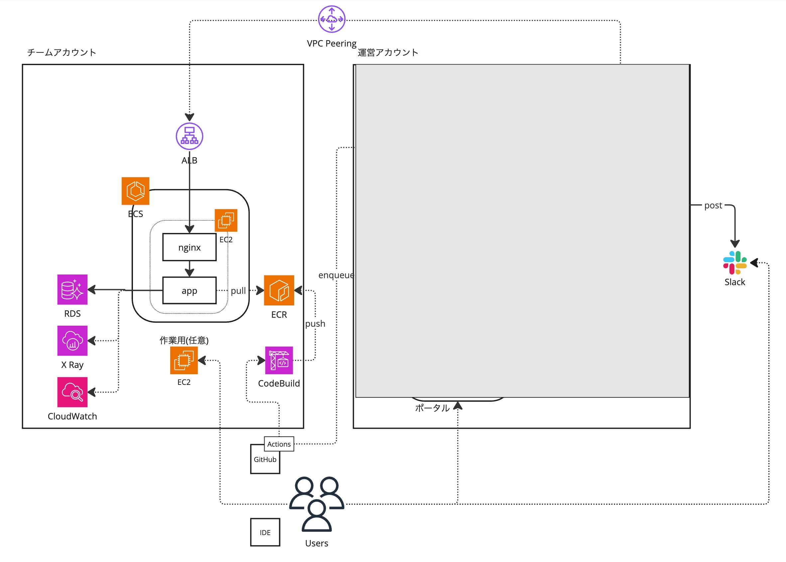
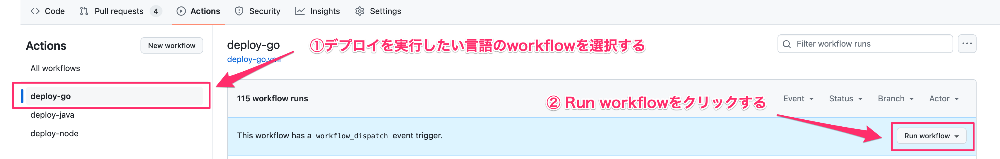
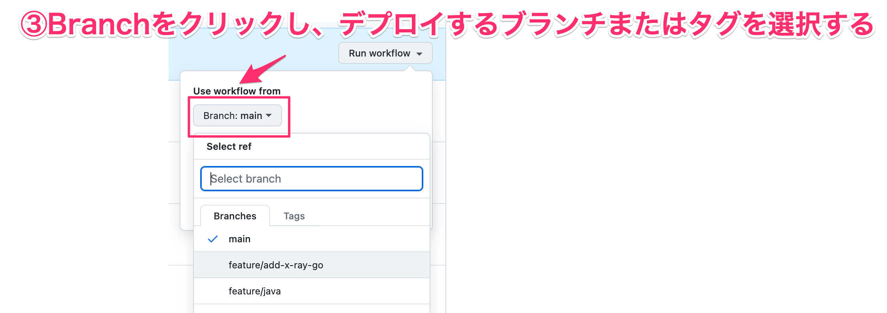
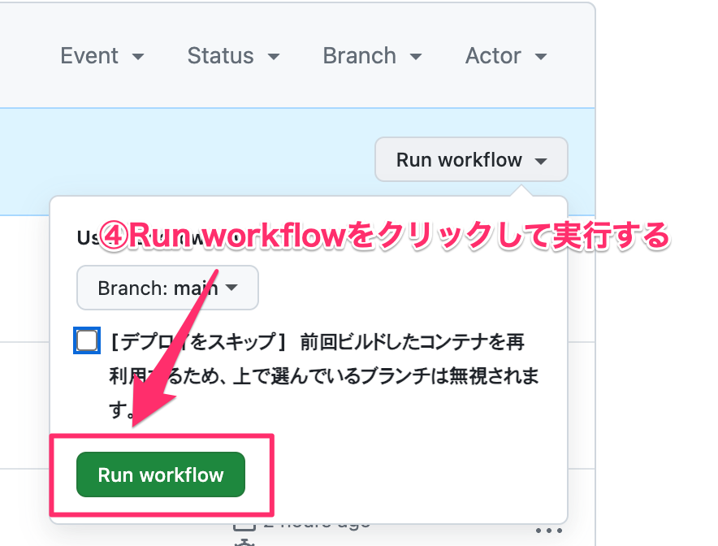
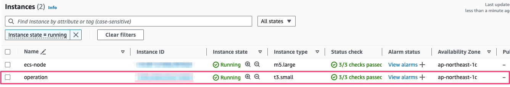
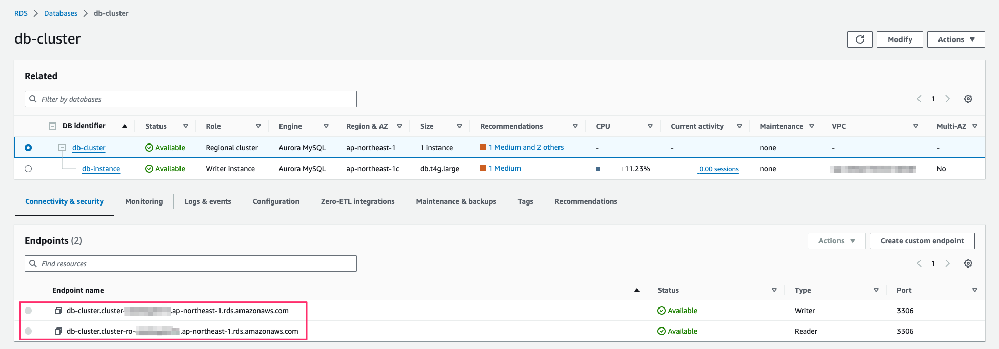
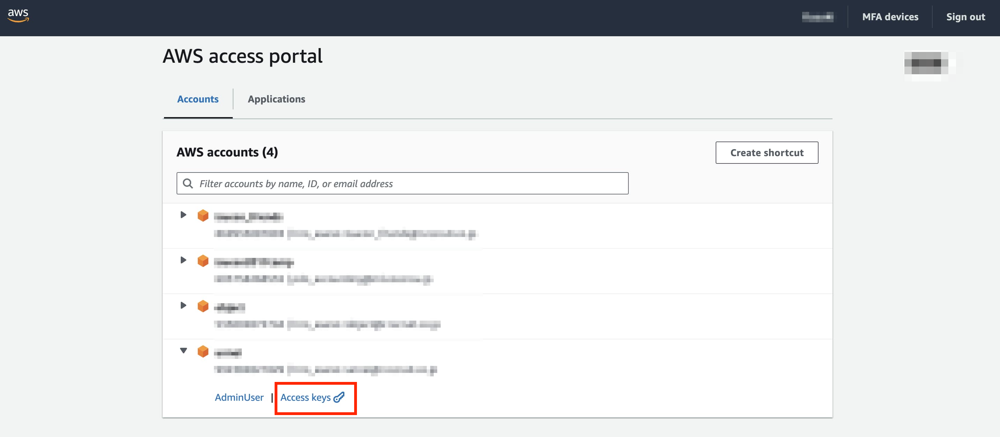

# はじめに

今回は社内イベントのため、以下のようなことが発生した場合は遠慮無く質問してください。

- インスタンスに入れなくなった。つながらない
- アプリケーションのbuildがうまく行かない
- 復旧不可能な状態になってしまった
- etc…


問題の答えに繋がるようなことについては回答できませんと返す場合もあります。


# 題材となるアプリケーションについて

現代社会において、オンラインでの求人活動は重要性を増しており、効率的で信頼性の高い求人プラットフォームが求められています。  
そのようなニーズに応えるために、risuworkでは、クライアント（CL）とカスタマー（CS）の双方が簡単かつ効果的に利用できる、包括的な求人管理機能を提供しています。

今回題材とするのは、risuworkで利用するAPIとなります。

## 用語


### クライアント(CL)

求人を作成し、候補者を募ることができるユーザー。
企業や人材を求める組織が該当します。

### カスタマー(CS)

求人を検索し、応募することができるユーザー。
就職や転職を希望する求職者が該当します。

## 機能一覧

APIでは、以下の機能を提供します。

* ログイン
    * CLおよびCSは、サービスを利用するためにログインを行います。
* 求人作成
    * CLは、自社の求人情報をAPIを通じて作成し、公開できます。
    * 求人情報には、職種、給与、勤務地などの詳細を含むことができます。
* 求人検索
    * CSは、APIを通じて求人を検索し、希望する条件に合致するものを見つけることができます。
    * フィルタリング機能により、詳細な条件での検索が可能です。
* 応募
    * CSは、検索結果から選んだ求人に対して応募することができます。


# 構成図


※ 競技開始時点でECSサービスは存在しません。後述するデプロイの初回実行時に作成されます


# ディレクトリ構成

```
├── deploy
├── go
├── java
├── lightbench
├── local-docker
├── nginx
├── nodejs
└── sql

```


| ディレクトリ | 説明 |
| -------- | -------- |
| deploy | ECSデプロイ用の定義ファイル ※ecspressoを利用 |
| go | go実装 |
| java | java実装 |
| lightbench | ローカル実行できる簡易ベンチマーカ（ローカルでのテストなどに利用する想定） |
| local-docker | ローカル実行用Docker設定 |
| nginx | nginx用の設定ファイル |
| nodejs | nodejs実装 |
| sql | DDL / 初期データセット |


# リポジトリのGitHub Actions

チームに配布されたリポジトリには、GitHub Actionsが設定されています。GitHub Actionsを実行することで、競技中の以下の操作を行います。

- デプロイ
- ベンチマーカの実行


# デプロイ&ベンチマーカの実行方法（参考実装の言語切り替え方法)

言語ごとにデプロイ&ベンチマーカ用のworkflowがあります。

- deploy-go
- deploy-node
- deploy-java

デプロイしたい言語に合わせて選択し、実行してください。

**workflowを実行すると、AWS環境へのデプロイおよびベンチマーカの実行が行われます。**

ベンチマーカの実行結果は、各チームのSlackに通知されます。

実行オプションでデプロイをスキップし、前回ビルドしたコンテナを再利用してベンチマーカを実行することも可能です（※手順は後述）

※ ベンチマーカの初回実行時、スコアが0となることがあります。その際は再実行いただき、解消しない場合は運営に問い合わせください

# 実行操作手順

1. デプロイを実行したい言語のworkflowを選択する
2. 「Run workflow」をクリックする
3. 「Branch」をクリックし、デプロイするブランチまたはタグを選択する（※「デプロイをスキップ」することで、前回ビルドしたコンテナを再利用することもできます。この場合、上で選んでいるブランチは無視されます）
4. 「Run workflow」をクリックして実行する








実行後、結果がSlackに表示されます。


# ローカルベンチの実行方法

アプリケーションに変更を入れた際に毎回CI/CDを走らせると手間がかかるので、ローカルで簡易的に整合性チェックをおこなえるツールを用意しております。


`./lightbench`配下に各環境用のバイナリが用意されています。

```
./lightbench/darwin_arm64/lightbench --help
lightbenchは手元でのローカル開発やCI上で簡易的なベンチマーカーとして利用できます。

Usage:
  lightbench <target_endpoint> [flags]

Examples:
  ./lightbench localhost:8080

Flags:
  -h, --help         help for lightbench
  -l, --long-load    長期間(60s)負荷をかけて擬似的な点数を計算するモード。出力される点数はあくまで参考値です
  -s, --short-load   短期間(10s)負荷をかけて擬似的な点数を計算するモード。出力される点数はあくまで参考値です
```
※ -lや-sなどのflagをつけない状態では、負荷走行はせず初期化処理と整合性チェックのみとなります。


# AWSコンソールへのログイン方法

| 項目          | 値           |
|-------------|-------------|
| **ログインURL** | ※当日限        |
| **id**      | 登録したメールアドレス |

## 作業用EC2への接続方法

データベースへのログインなどの運用作業用にEC2を配布しています。

Name:`operation` のインスタンスを利用してください。



接続には、セッションマネージャーを利用してください。
セッションマネージャーを使用してEC2インスタンスに接続する手順は以下を参考にしてください。

https://docs.aws.amazon.com/ja_jp/AWSEC2/latest/UserGuide/connect-with-systems-manager-session-manager.html


# RDS Aurora for MySQLへの接続

`operation` に接続し、以下のコマンドでMySQLに接続できます。

```
sudo su - ec2-user # ec2-userに切り替える
docker run -it --rm --entrypoint mysql mysql:8 -h[配布されたRDSのendpoint] -u[username] -p[password]
```

Masterのusername/passwordは以下になります。

| Master username | Master password |
| --------------- | ----------------|
| root            | password        |

配布されたRDSのendpointはRDSのページで確認できます。



# ローカルでログを見る

`Amazon CloudWatch Logs`に入っているログをローカルのコンソール上で閲覧します

これに[awslogs](https://github.com/jorgebastida/awslogs)コマンドという3rd partyのCLIを利用します

※ AWS公式CLIのaws logsサブコマンドではフォーマットが上手く合わず他ツールでの利用が煩雑なためこちらを利用しています。


# awslogsの設定

AWS公式CLIのprofileを利用して権限をCLIに付与します。

IAM IDentity Centerログイン時に出てくるアクセスキーを`~/.aws/credentials`に書き込むことでプロファイルが作成できます。




# Nginxのアクセスログを見る

fooプロファイルの権限で、10分前から5分前までのNginxのログを取得し、access.logというファイルに吐き出すコマンド

```
awslogs get /ecs/nginx ALL -GS -s10m -e5m --profile foo > access.log
```

# RDSのスロークエリログを見る


fooプロファイルの権限で、10分前から5分前までのスロークエリログを取得し、slowquery.logというファイルに吐き出すコマンド

```
awslogs get /aws/rds/cluster/db-cluster/slowquery ALL -GS -s10m -e5m --profile foo > slowquery.log
```

# 競技中に利用を推奨するAWSサービス

パフォーマンスチューニング時に利用するAWSサービスとして、以下サービスを有効化しており、利用を推奨しています。
ボトルネックの特定にぜひご活用ください。

- [X-Ray](https://docs.aws.amazon.com/ja_jp/xray/latest/devguide/aws-xray.html)
- [Container Insights](https://docs.aws.amazon.com/ja_jp/AmazonCloudWatch/latest/monitoring/ContainerInsights.html)
- [Performance Insights](https://docs.aws.amazon.com/ja_jp/AmazonRDS/latest/UserGuide/USER_PerfInsights.html)
