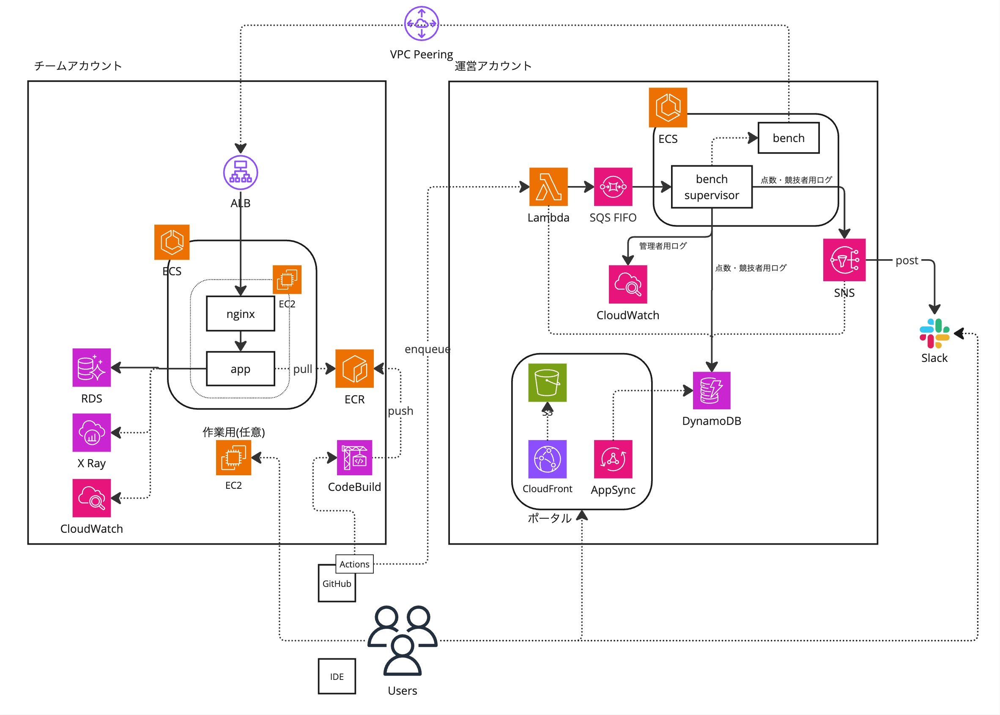

## infrastructure

### 概要
以下イメージの環境を構築するための OpenTofu 定義。  
ある程度流用可能なようにはしていますが、一部既存リソースを前提にしているものや、構築進める中で継ぎ足していったものもあるため、基本的には定義の参考にする程度で見ていただければと思います。

### 構成イメージ

### 構築手順
動作の保証はできませんが、構築を試したい場合は以下手順で実行は可能な想定です。

1. 各種設定ファイルの作成（リンク先はサンプル定義）
   - [files/operators.yml](files/operators.yml.sample)
   - [files/secrets.yml](files/secrets.yml.sample)
   - [files/teams.yml](files/teams.yml.sample)
   - [environments/organization/files/common.yml](environments/organization/files/common.yml.sample)
2. organization root module の apply
3. operation root module の `aws_vpc_peering_connection_accepter` 以外の apply
4. participants root module の apply
5. operation root module の apply
